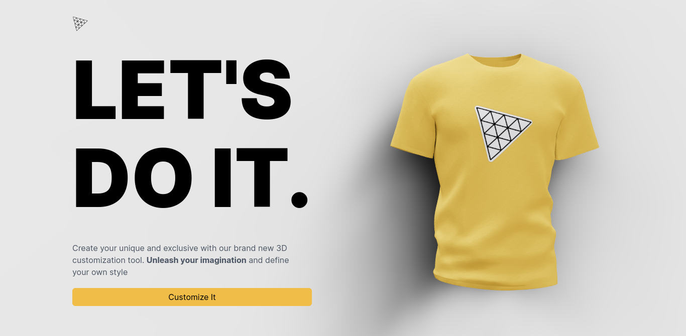

  

# :star2: Shirt-Viz
T-shirt product 3D visualizer and AI image generation web app for fancy T-shirt printing business

## :fire: Stack
- ReactJs
- ThreeJs
- Voltio
- Tailwindcss

[:sparkles: Visit live link](https://shirt-viz.vercel.app/)
